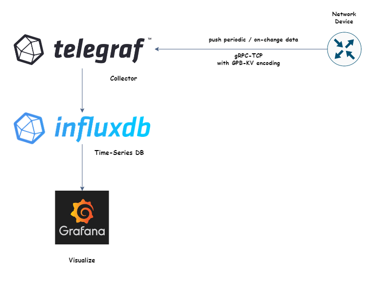

# Model-Driven Telemetry 

## Setup GRPC Dial-out Telemetry Using TIG Stack 

*Telegraf*: is an server agent to help collect metrics, we are using its [cisco_telemetry_mdt](https://github.com/influxdata/telegraf/blob/release-1.23/plugins/inputs/cisco_telemetry_mdt/README.md)
plugin, which let telegraf understands GPB-KV (self-describing-gpb) encoding, sent by our Cisco device.

**InfluxDB**: an high performance, scalable Time-series database

**Grafana**: plantform to query,analyze and visualize the metrics , allows us to build dynamic dashboards and generate alerts

> **Note**
> all above tools are open-sourced

## Spin-up 

> docker-compose up -d

